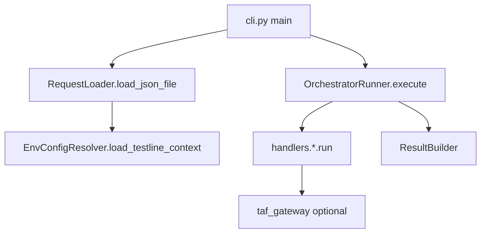

# test-workflow-runner 代码框架说明

本文档说明 `test-workflow-runner` 模块的**分层、各 Python 文件职责、典型调用链**，以及**后续改代码时内容应落在哪里**，避免动到大框架时迷失方向。  
（与 `docs/modules/test-workflow-runner/` 下的教学 step 互补：本文件偏「工程地图」，step 偏「按步实现」。）

## 1. 模块在仓库里的位置

- **本目录**：`test-workflow-runner/` = 执行层：读取 workflow 请求、调度 stage/item、接入 TAF/脚本/Robot 侧能力、输出 `result.json` 等。
- **不在这里做的事**：`platform-api` 的 Web API 契约、SQLite 中 run 记录、React portal（见仓库其他模块）。

## 2. 分层总览

```text
入口层          cli.py
请求与解析层    request_loader.py, models.py
测试线解析与上下文层 config_resolver.py, ue_extractor.py
安全校验层      safety.py
执行编排层      runner.py, taf_gateway.py
单步能力层      handlers/*.py, handlers/base.py
后处理/内部工具  internal_tools/kpi_generator, internal_tools/kpi_detector
结果落盘         result_builder.py
测试            tests/
配置样例         configs/
```

- **数据形态**：工作流请求是 JSON，顶层以 `testline` 标识测试线；内部从完整名派生 `config_id` / alias（如 `Txxx`）用于 `configs/env_map.json` 等。
- **Runner 的「model」不是 ML**，而是 `traffic_plan` 里每个 `item` 的 `model` 字段，对应一种 handler（如 `attach`、`dl_traffic`）。

## 3. 目录与包结构

| 路径 | 说明 |
|------|------|
| `test_workflow_runner/` | 可 import 的 Python 包，执行主逻辑。 |
| `test_workflow_runner/handlers/` | 每种 `item.model` 一个 Handler 类。 |
| `internal_tools/` | 随仓库携带的 kpi_generator / kpi_detector 等后处理实现，**尽量不改协议时只经 handler 调用**。 |
| `configs/` | 样例如 `env_map.json`、`sample_request.json` 等。 |
| `tests/` | pytest，覆盖 loader、runner、CLI 等。 |

## 4. 各核心文件职责

### 4.1 入口

| 文件 | 职责 |
|------|------|
| `test_workflow_runner/cli.py` | 命令行入口：读 JSON 请求、可选 `--dry-run`、调用 `RequestLoader`、构造 `TestlineContext` 或从 `EnvConfigResolver` 加载、跑 `OrchestratorRunner`、用 `ResultBuilder` 写结果文件。 |
| `test_workflow_runner/__init__.py` | 包初始化（通常保持精简）。 |

### 4.2 请求、模型、测试线解析

| 文件 | 职责 |
|------|------|
| `test_workflow_runner/models.py` | 数据结构：`KpiTestModelRequest`、`TrafficStage` / `TrafficItem`、`OrchestratorState`、`HandlerResult`、`ResolvedConfig`、`TestlineContext` 等；`normalize_testline` / `derive_testline_alias` 等。 |
| `test_workflow_runner/request_loader.py` | 从 dict/JSON 校验并组装 `KpiTestModelRequest`；对接 `config_resolver` 做真实 testline 或 dry-run 的 `ResolvedConfig`。 |
| `test_workflow_runner/config_resolver.py` | 根据 `testline` 派生 key、读 `configs/env_map.json`、定位 `testline_configuration` 下配置、动态加载 `tl` 模块、构建 `TestlineContext`；`validate_script_path` 等。 |

### 4.3 执行编排

| 文件 | 职责 |
|------|------|
| `test_workflow_runner/runner.py` | `OrchestratorRunner`：按 stage 串/并行执行 item，分发给 `handlers`，汇总 `OrchestratorState`。 |
| `test_workflow_runner/taf_gateway.py` | 可选：从 `runtime_options.bindings_module` 或环境变量动态 import TAF/绑定模块，对真实执行暴露统一 `execute(action, context)`。 |
| `test_workflow_runner/safety.py` | 对并行 stage 做资源域校验。典型 CLI 路径下，这些校验会在 `RequestLoader` 阶段作为请求校验失败直接阻断；若调用方绕过 loader 或运行期继续复检，则会以 `validation_warnings` 的形式挂到结果里。 |
| `test_workflow_runner/ue_extractor.py` | 从 testline 的 `tl` 对象里抽取规范化 UE 列表。 |

### 4.4 Handlers（单步能力）

| 文件 | 职责 |
|------|------|
| `test_workflow_runner/handlers/base.py` | 基类 `BaseHandler`：`HandlerContext`、dry-run 与真实 TAF/子进程的通用封装（`execute_taf_action` / `execute_command` 等）。 |
| `test_workflow_runner/handlers/attach.py` 等 | 各 `model` 一个文件：`AttachHandler` 对应 `model == "attach"`。 |
| `test_workflow_runner/handlers/kpi_generator.py` | 调用 `internal_tools.kpi_generator` 的入口封装；可在入参中注入与 `testline` 相关字段。 |
| `test_workflow_runner/handlers/kpi_detector.py` | 同上，对接 `internal_tools.kpi_detector`。 |
| `test_workflow_runner/handlers/__init__.py` | 集中导出各 Handler 类。 |

**约定**：业务上新增一种 traffic 能力时，优先在这里新增 `xxx.py` 并在 `runner.py` 的 `handler_registry` 中注册，并在 `models.SUPPORTED_TRAFFIC_MODELS`（或等价的校验表）中列出；如果这个新 `model` 参与并行 stage 的资源约束判断，还要同步更新 `safety.py` 里的资源域映射。

### 4.5 后处理与内部工具

| 路径 | 职责 |
|------|------|
| `internal_tools/kpi_generator/` | KPI 报告生成等（具体 API 见 `service.py` / `core.py`）。通过 handler 注入 payload。 |
| `internal_tools/kpi_detector/` | KPI 检测、报表等；同样经 handler 调用。 |
| `internal_tools/__init__.py` | 说明为 vendored 工具包即可。 |

### 4.6 结果

| 文件 | 职责 |
|------|------|
| `test_workflow_runner/result_builder.py` | 将 `OrchestratorState` + 上下文 组装为可序列化的 dict，并写入 JSON 文件。 |

## 5. 典型调用链

### 5.1 CLI 非 dry-run



### 5.2 CLI dry-run

- 不依赖真实 `env_map` / 磁盘上的 testline 配置时：`RequestLoader` 在 `require_env_map=False` 下走简化 `ResolvedConfig`，CLI 侧再基于请求里的 `selected_ues` 构造一个最小 `TestlineContext`；`OrchestratorRunner` 仍跑 handler，多数在 `dry_run` 下只写 summary。

### 5.3 单条 item 在 runner 内

```text
OrchestratorRunner._execute_item
  -> handler = handler_registry[item.model]
  -> handler.run(HandlerContext(request, testline_context, item, ...))
  -> BaseHandler: dry_run 或 gateway.execute 或子进程
```

## 6. 以后改代码：内容应落在哪里

| 你想做的事 | 建议落点 |
|------------|----------|
| 加一种新的 stage item 类型（新的 `model` 字符串） | 新建 `handlers/你的模型.py` + 注册到 `runner.py` + 更新 `SUPPORTED_TRAFFIC_MODELS` / `request_loader` 校验；如果它有资源域/并行限制语义，还要同步更新 `safety.py` 的 `MODEL_RESOURCE_DOMAINS`。 |
| 改 workflow JSON 字段、校验规则 | `models.py` + `request_loader.py`（少动 `runner` 主循环 unless 执行语义变）。 |
| 改 testline 与 `env_map` 的对应关系 | `config_resolver.py` + 文档/样例 `configs/env_map.json`。 |
| 改 TAF/真实设备调用方式 | `taf_gateway.py` + 对应 `handlers` 中 `BaseHandler` 的调用路径。 |
| 改 kpi_generator / kpi_detector 行为 | 以 `internal_tools/...` 为主；**对外契约**变化时同时改 `handlers` 的 payload 与文档。 |
| 改输出 JSON 形状 | `result_builder.py` + 如需要同步 `platform-api` 侧对 artifact 的约定。 |
| 新加命令行参数 | `cli.py`，并保持 `main()` 可被测试 import。 |

## 7. 与 `platform-api` 的边界（便于联调时脑子清醒）

- **platform-api**：管 run 记录、Jenkins 回调、artifact 清单与 KPI/摘要查询 API。  
- **test-workflow-runner**：管「在 Agent/UTE 上怎么跑完 workflow 并产本地结果」。  
- 两者通过 **`run_id`、callback URL、artifact 路径、日志约定** 对齐，不互相 import 对方代码。

## 8. 维护提示

- 大框架优先稳定：**loader → runner → handler → result** 这条线不要轻易分叉成两套。  
- 大逻辑新增用 **新 handler 文件** 或 **小模块**，避免把 `runner.py` 扩成千行。  
- 并行安全规则不是纯提示文案：CLI 主路径里通常会在 loader 阶段直接拦截，不要只改 `runner.py` / `handlers` 而忘了 `safety.py`。  
- 与 Day1/门户对齐的字段名，以 `docs/modules/platform-api` 与 `schemas/run.py` 为准，执行层用 `testline` 等与之对齐的语义。

（文档版本：与当前仓库 `test_workflow_runner` 包结构一致，若你后续只改文件不改分层，可仅更新上表行号/文件名。）
