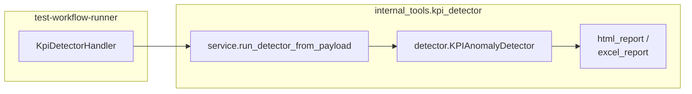
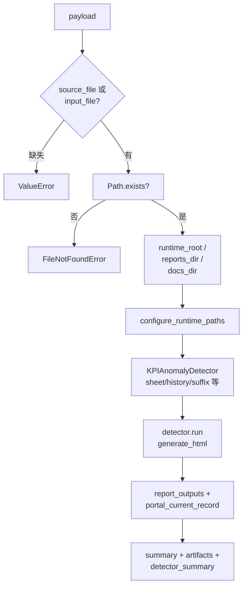
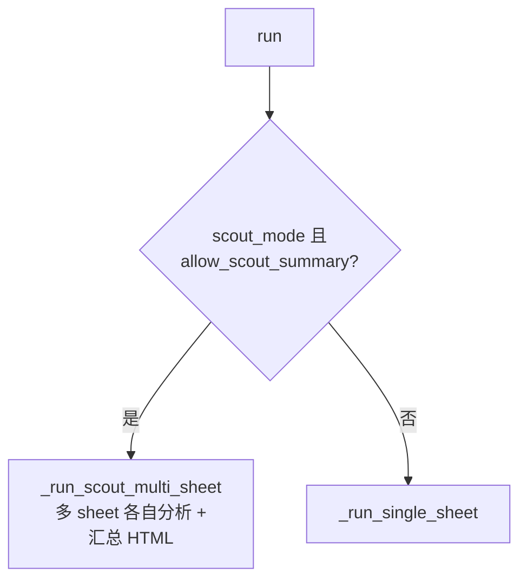
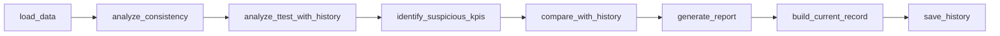

# kpi_detector 模块架构与实现流程

本文档描述 **`C:\TA\jenkins_robotframework\test-workflow-runner\internal_tools\kpi_detector`** 的职责边界、包内分层、对外入口及 **`KPIAnomalyDetector.run`** 主流程（含流程图）。包版本见 **`__init__.py`**（如 `2.3.0`）；实现以源码为准。

---

## 1. 模块定位

### 1.1 负责什么

- 对 **KPI 报告 Excel**（通常为 Compass / generator 产出的 **`KPI Report`** 表结构）做 **一致性（CV）**、**与历史对比（t-test 等）**、**按 KPI 类型的异常策略**、**Guard Rails**、**Shewhart / 策略检测器** 等分析。
- 生成 **Excel / HTML** 报告（汇总与明细），并将当前运行摘要写入 **`kpi_history_records.json`**（或 Scout 模式下的 **`kpi_history_records_scout.json`**），便于后续运行匹配历史。
- 通过 **`run_detector_from_payload`** 供 **`test_workflow_runner.handlers.kpi_detector`** 调用。

### 1.2 不负责什么

- **Compass** 拉数与 KPI 报告生成（见 **`internal_tools/kpi_generator`**）。
- **workflow** 编排与 item 并行（见 **`test_workflow_runner`**）。

### 1.3 在仓库中的位置



---

## 2. 包内文件与职责

| 路径 | 职责 |
|------|------|
| **`__init__.py`** | 导出 **`run_detector_from_payload`**、`KPIAnomalyDetector`、`configure_runtime_paths`、`kpi_types` 工厂与枚举等。 |
| **`service.py`** | **唯一推荐入口**：校验 **`source_file` / `input_file`**，计算 **`runtime_root` / `reports_dir` / `docs_dir`**，调用 **`configure_runtime_paths`**，构造 **`KPIAnomalyDetector`**，执行 **`detector.run()`**，从 **`report_outputs`** 与 **`portal_current_record`** 组装 **`summary` / `artifacts` / `detector_summary`**。 |
| **`detector.py`** | **`KPIAnomalyDetector`**：加载数据、一致性分析、t-test 与历史对比、可疑 KPI 识别、报告生成、**`build_current_record` / `save_history`**；**`run()`** 分 **Scout 多 sheet** 与 **标准单 sheet** 两条路径。 |
| **`config.py`** | **`PATHS`**（`data` / `reports` / `docs`）、**`COLORS`**、默认 CV/P 阈值、**历史 JSON 文件名**、`FILENAME_PATTERN`；**`configure_runtime_paths`** 会 **mkdir**。 |
| **`kpi_types.py`** | KPI 类型、检测策略、**`get_classifier` / `get_type_based_detector` / `get_strategy_based_detector`** 等策略分发。 |
| **`guard_rails.py`** | Guard rails 与检测管线集成（**`integrate_guard_rails_with_detection`**）。 |
| **`shewhart.py`** | 基于历史的严重度等辅助计算。 |
| **`utils.py`** | Code 分类、原始数据解析、CV 等统计小函数。 |
| **`excel_report.py` / `html_report.py`** | 报表生成器类。 |
| **`assets/kpi_xml/`** | 规则/模板类静态资源（XML、JSON）。 |

---

## 3. 对外入口：`run_detector_from_payload`



**常用 payload 字段**（节选，以 `service.py` 为准）：

- **`source_file` / `input_file`**：必填其一，指向待分析 xlsx。
- **`runtime_root`**：默认 `cwd/kpi-artifacts/kpi_detector/<item_id|stem>/`。
- **`reports_dir` / `docs_dir`**：可选覆盖；历史 JSON 默认在 **`reports_dir`** 下。
- **`sheet_name` / `history_sheet_name` / `history_filename` / `report_suffix`**
- **`allow_scout_summary`**、**`generate_html`**：布尔类字符串 **`_truthy`** 解析。

**artifacts**：`detector_html_report`、`detector_excel_report`、以及多份 **detail** HTML/Excel（若存在路径列表）。

---

## 4. `KPIAnomalyDetector.run` 内部分支



### 4.1 标准路径：`_run_single_sheet`

顺序为**固定流水线**（见 `detector.py`）：

```text
load_data
  -> analyze_consistency
  -> analyze_ttest_with_history
  -> identify_suspicious_kpis
  -> compare_with_history
  -> generate_report
  -> build_current_record
  -> save_history
```



初始化阶段会：根据**文件名**解析 **release / environment / UE / scenario**（**`FILENAME_PATTERN`**），解析失败则 **`ValueError`**；挂载 **history 文件路径**（标准 vs **scout** 不同文件名）、**`kpi_classifier` / `type_based_detector` / `guard_rails` / `strategy_detector`**。

### 4.2 Scout 路径：`_run_scout_multi_sheet`

对 **Scout 风格** 多 sheet 工作簿逐 sheet 跑检测逻辑，聚合统计，并生成 **汇总 trend viewer HTML**（与标准单表 **history 键** 策略区分，使用 **`kpi_history_records_scout.json`** 等分支逻辑）。

---

## 5. 运行时目录与历史

- **`configure_runtime_paths`** 后，全局 **`PATHS['reports']`**、**`PATHS['docs']`** 等指向本次 **runtime_root** 派生目录。
- **历史文件**：默认 **`PATHS['reports'] / kpi_history_records.json`**（或 scout 文件名），用于跨次运行匹配与对比。
- **静态资源**：**`ASSETS_DIR`** = 包内 **`assets/kpi_xml`**。

---

## 6. 与 test-workflow-runner 的衔接

| 项目 | 说明 |
|------|------|
| **调用方** | `handlers/kpi_detector.py` → **`run_detector_from_payload(payload=params, item_id=...)`** |
| **默认注入** | **`environment`** ← `resolved_config.config_id`，**`test_line`** ← `request.testline`（与 generator handler 一致） |
| **dry-run** | handler 不调用本包。 |
| **失败** | handler 捕获异常 → **`build_failure`**。 |
| **结果分桶** | **`result_bucket = "followups"`**；**`detector_summary`** 供上层回调 **platform-api** 等契约使用。 |

---

## 7. 相关路径索引

| 说明 | 路径 |
|------|------|
| 本模块 | `test-workflow-runner/internal_tools/kpi_detector/` |
| 推荐入口 | `internal_tools/kpi_detector/service.py` |
| 核心类 | `internal_tools/kpi_detector/detector.py` |
| 配置与路径 | `internal_tools/kpi_detector/config.py` |
| 调用方 Handler | `test-workflow-runner/test_workflow_runner/handlers/kpi_detector.py` |
| 姊妹模块说明 | `test-workflow-runner/internal_tools/kpi_generator/ARCHITECTURE.md` |
| 上层架构 | `test-workflow-runner/ARCHITECTURE.md` |
