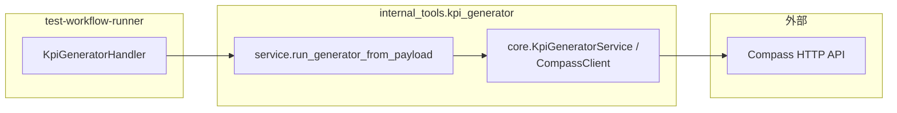
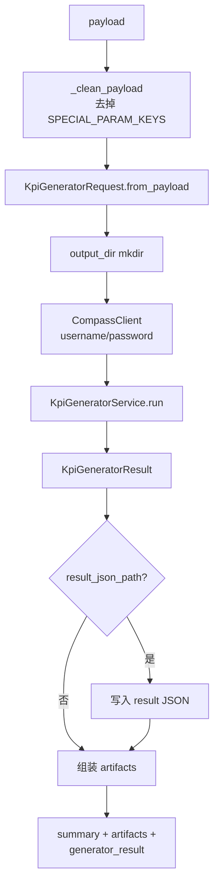
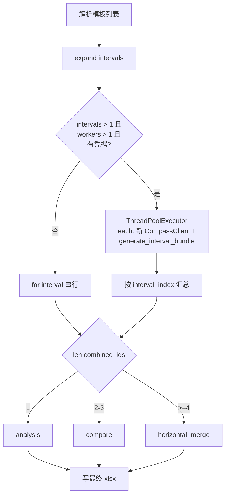
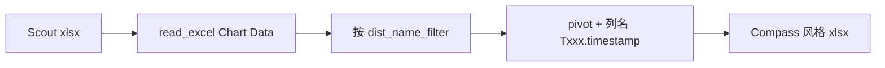

# kpi_generator 模块架构与实现流程

本文档描述 **`C:\TA\jenkins_robotframework\test-workflow-runner\internal_tools\kpi_generator`** 的职责边界、包内分层、对外入口及 **`KpiGeneratorService.run`** 主流程（含流程图）。实现细节（Compass HTTP、Excel 整形）主要在 **`core.py`**；**常量与纯文本解析**已拆到 **`_constants.py`**、**`_text.py`**。

---

## 1. 模块定位

### 1.1 负责什么

- 通过 **Compass** HTTP API：**登录**、拉 **KPI template set**、**按模板与时间窗生成报告**、**合并同一 interval 的多模板报告**、最终 **单报告分析 / 多报告 compare / 多 interval horizontal_merge**，产出 **`.xlsx` KPI 报告**。
- 将 **Scout** 导出的 **`Chart Data`** 表转换为 **Compass 风格** 多 sheet 工作簿（**`convert_scout_report_to_compass_format`**），列名对齐下游 **kpi_detector** 的 **Txxx.YYYYMMDD_HHMMSS** 等约定。
- 通过 **`run_generator_from_payload`** 供 **`test_workflow_runner.handlers.kpi_generator`** 调用；可选 **`core.main`** CLI（`--request-json` / `--scout-report` 等）。

### 1.2 不负责什么

- **KPI 异常检测** 与历史 JSON 维护（见 **`internal_tools/kpi_detector`**）。
- **workflow** 编排（见 **`test_workflow_runner`**）。

### 1.3 在仓库中的位置

---

## 2. 包内文件与职责

| 路径 | 职责 |
|------|------|
| **`__init__.py`** | 从 **`core`** 导出请求/结果/客户端/服务/异常/Scout 转换；从 **`service`** 导出 **`run_generator_from_payload`**。 |
| **`service.py`** | **编排器入口**：剥离 handler 注入的 **`SPECIAL_PARAM_KEYS`**（`_stage_id`、`output_dir`、`result_json_path`、`verbose`、Compass 账号等），构造 **`KpiGeneratorRequest`**、**`CompassClient`**、**`KpiGeneratorService`**，调用 **`service.run(request)`**，可选写 **`result_json`**，返回 **`summary` + `artifacts` + `generator_result`**。 |
| **`_constants.py`** | Compass/模板/进度等**常量**与 **`urllib3`** 告警静默。 |
| **`_text.py`** | **`configure_logging`**、文件名与模板解析、**`emit_progress`**、**`resolve_test_line`** 等无 HTTP 依赖的工具函数。 |
| **`core.py`** | **主体实现**：**`KpiGeneratorRequest`** / **`TimeRange`**、**`CompassClient`**、**`KpiGeneratorService.run`**（含 **多 interval 并行**）、Excel 与 Scout 转换、**`main()`**。 |

**并行说明**：当展开后 **interval 数 > 1** 且 **`effective_interval_worker_count` > 1** 时，每个 interval 在独立线程中使用 **独立 `CompassClient`（独立 `requests.Session`）** 执行 **`generate_interval_bundle`**。**`max_interval_workers`** 可在请求 JSON 中设置（上限 **`MAX_INTERVAL_WORKERS_CAP`**）；也可用环境变量 **`KPI_GENERATOR_MAX_INTERVAL_WORKERS`**（默认 **`DEFAULT_MAX_INTERVAL_WORKERS`**）。**`max_interval_workers: 1`** 或仅 1 个 interval 时强制串行；缺少 Compass 凭据时自动退回串行。同一 interval 内**多模板**仍为串行，与原先一致。

---

## 3. 对外入口：`run_generator_from_payload`

**`SPECIAL_PARAM_KEYS`**（不参与 `KpiGeneratorRequest` 字段映射）：`_stage_id`、`output_dir`、`result_json_path`、`verbose`、`compass_username`、`compass_password`。

**`KpiGeneratorRequest` 核心字段**（见 `core.from_payload`）：**`template_set_name` / `template_names`**、**`build`**、**`environment`**、**`scenario`**、**`report_timestamps_list`**、可选 **`timestamp_delta_minutes`**、解析得到的 **`test_line`**（可由 payload 覆盖）、可选 **`max_interval_workers`**（并行 interval 上限）。

**凭据**：`CompassClient` 使用参数或环境变量 **`COMPASS_USERNAME` / `COMPASS_PASSWORD`**；缺失则 **`ValueError`**。

---

## 4. `KpiGeneratorService.run` 主流程（Compass 模式）

### 4.1 总览

1. **解析模板名**：若有 **`template_set_name`**，则 **`list_template_sets` + `get_template_set_names`**；与手动 **`template_names`** 合并去重。
2. **时间窗**：**`split_intervals`** 按 **`timestamp_delta_minutes`** 切分。
3. **每个 interval**：对每个模板 **`generate_new_report`** → 收集 report_id → **`combine_kpi_report`** → 得到该 interval 的 **combined_id**（失败则记入 **`failed_templates` / `failed_intervals`**）。同一 interval 内多模板仍**串行**。
4. **最终报告**：根据 **combined 报告个数** 选择 **`final_operation`**：  
   - **1 个** → **`get_analysis_kpi_result`**（analysis）  
   - **2–3 个** → **`get_compare_report`**（compare）  
   - **≥4 个** → **`horizontal_merge_reports`**  
5. 写出 **`report_path`**（**`build_final_filename`**），组装 **`KpiGeneratorResult`**；最终步骤失败时抛 **`KpiGeneratorExecutionError`**（携带部分 **result** 便于落盘）。

**多 interval**：若展开后 interval 数 **> 1**、**`effective_interval_worker_count` > 1** 且存在 Compass 凭据，各 interval 在 **`ThreadPoolExecutor`** 中并发执行 **`generate_interval_bundle`**（每线程 **独立 `CompassClient`**）；结果按 **`interval_index` 排序** 再进入最终 compare/merge，与原先全串行时 **combined_report_ids** 顺序一致。否则串行循环。

进度与集成：多处 **`emit_progress`** 打印 **`__KPI_PROGRESS__` + JSON** 行，便于外层日志采集。

---

## 5. Scout 转换（独立能力）

**`convert_scout_report_to_compass_format`**：读 Scout xlsx 固定 sheet **`Chart Data`**（列 **DistName / EntryName / GroupName / TimeStamp / Value**），按 **`dist_name_filter`** 过滤、pivot 为 **Code / KPI Name / Group Name** + **探测器兼容列名**，多 filter 多 sheet，写 **`openpyxl`** 并套样式。可由 **`core.main --scout-report`** 单独调用。

---

## 6. 与 test-workflow-runner / kpi_detector 的衔接

| 项目 | 说明 |
|------|------|
| **调用方** | `handlers/kpi_generator.py` → **`run_generator_from_payload`** |
| **默认注入** | **`environment`** ← `config_id`，**`test_line`** ← `request.testline` |
| **输出目录** | 默认 **`cwd/kpi-artifacts/kpi_generator/<item_id>`** |
| **dry-run** | handler 不调用本包。 |
| **下游** | 最终 xlsx 的 **KPI Report** 表头与 **`build_detector_data_column_name`** 等约定便于 **`kpi_detector`** 消费。 |

---

## 7. 相关路径索引

| 说明 | 路径 |
|------|------|
| 本模块 | `test-workflow-runner/internal_tools/kpi_generator/` |
| Handler 入口封装 | `internal_tools/kpi_generator/service.py` |
| Compass 与 Excel 实现 | `internal_tools/kpi_generator/core.py` |
| 调用方 Handler | `test-workflow-runner/test_workflow_runner/handlers/kpi_generator.py` |
| 下游检测说明 | `test-workflow-runner/internal_tools/kpi_detector/ARCHITECTURE.md` |
| 上层架构 | `test-workflow-runner/ARCHITECTURE.md` |
