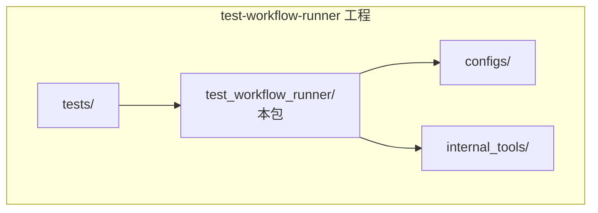
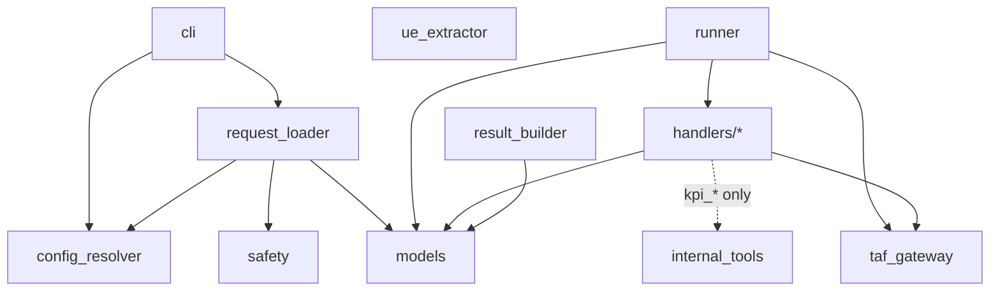
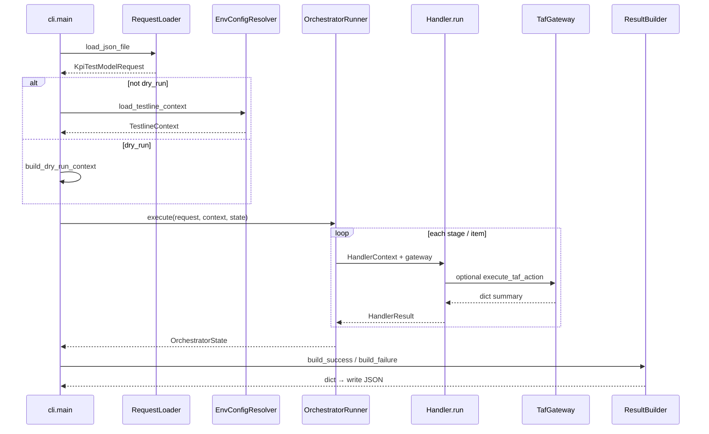
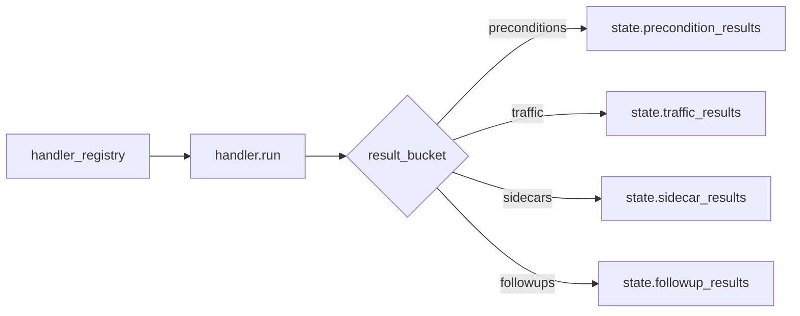
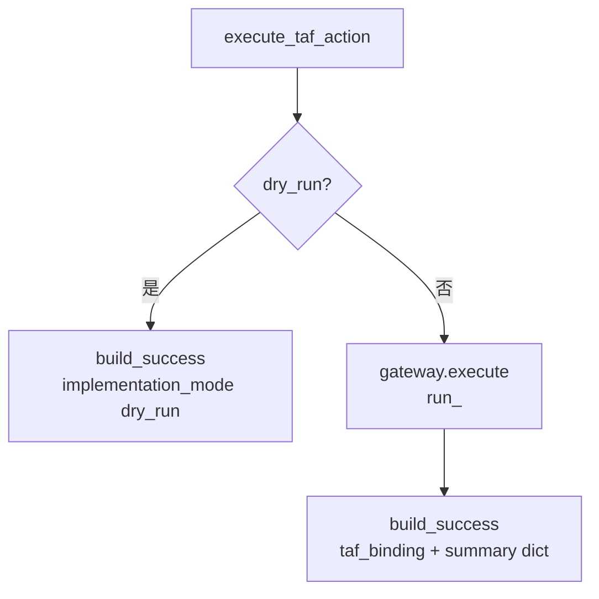
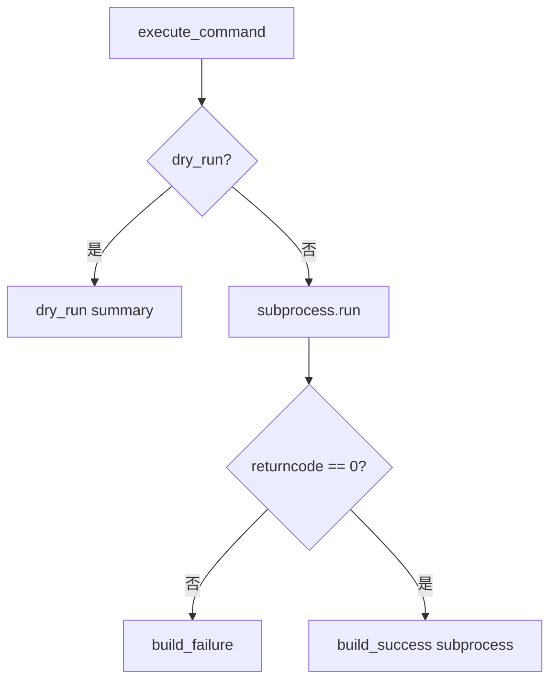
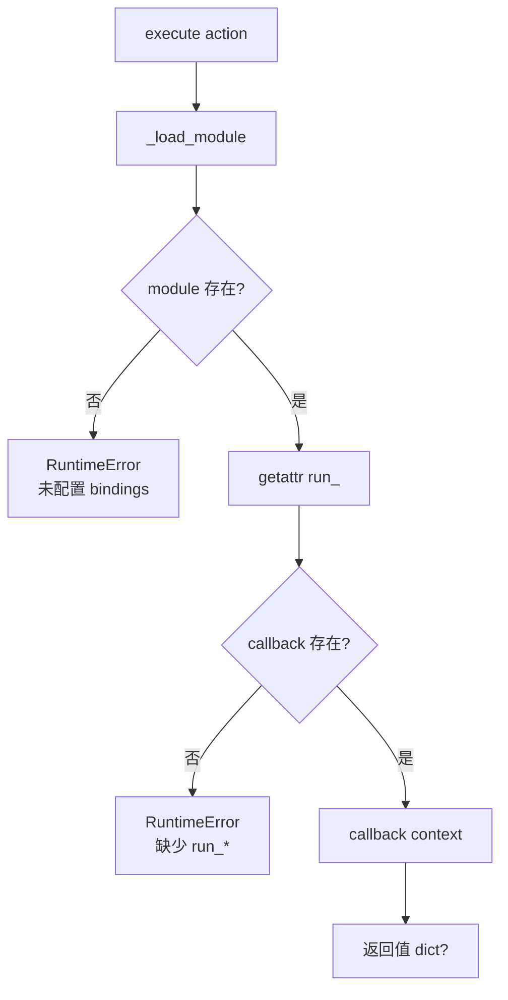

# `test_workflow_runner` 包架构与实现流程

本文档从 **Python 包 `test_workflow_runner/`** 自身描述目录结构、模块依赖、**CLI → Loader → Runner → Handlers → ResultBuilder** 的实现要点与流程图。与仓库根 **`test-workflow-runner/ARCHITECTURE.md`**（整条产品线视角）互补；冲突时以**源码**为准。

---

## 1. 包在仓库中的位置

| 路径 | 说明 |
|------|------|
| **`test_workflow_runner/`** | 可安装/可 `python -m test_workflow_runner.cli` 的包目录（本文件所在树）。 |
| **`test-workflow-runner/`**（上级） | 工程根：`configs/`、`tests/`、`internal_tools/`、`README` 等。 |



---

## 2. 包内目录与文件职责

```text
test_workflow_runner/
  __init__.py          对外导出 OrchestratorRunner、KpiTestModelRequest、OrchestratorState
  cli.py               命令行入口（argparse → Loader → Context → Runner → ResultBuilder）
  models.py            请求/阶段/Item/UE/状态/ResolvedConfig 等数据类；SUPPORTED_TRAFFIC_MODELS
  request_loader.py    JSON → KpiTestModelRequest；validate_payload；与 safety 联动
  config_resolver.py   env_map + testline_configuration → TestlineContext
  ue_extractor.py      从 tl 对象抽取 NormalizedUe 列表
  safety.py            MODEL_RESOURCE_DOMAINS；validate_parallel_stage
  runner.py            OrchestratorRunner；handler_registry；串/并行 stage
  taf_gateway.py       动态 import bindings_module；execute(action, context)
  result_builder.py    OrchestratorState → 顶层 result dict + timeline + manifest
  handlers/
    __init__.py        导出各 Handler 类
    base.py            HandlerContext、BaseHandler、build_*、execute_taf_action、execute_command
    *.py               一种 traffic model 一个 Handler 文件
```

### 2.1 `handlers` 与 `model` 对应表

| 文件 | `model_name` | `result_bucket` | 说明 |
|------|----------------|-----------------|------|
| `apply_preconditions.py` | `apply_preconditions` | `preconditions` | 前置条件 |
| `attach.py` | `attach` | `traffic`（继承 base） | UE 附着等 |
| `handover.py` | `handover` | `traffic` | 切换 |
| `dl_traffic.py` | `dl_traffic` | `traffic` | 下行流量脚本 |
| `ul_traffic.py` | `ul_traffic` | `traffic` | 上行流量脚本 |
| `swap.py` | `swap` | `traffic` | |
| `detach.py` | `detach` | `traffic` | |
| `syslog_check.py` | `syslog_check` | `sidecars` | 旁路观察 |
| `kpi_generator.py` | `kpi_generator` | `followups` | 调 `internal_tools.kpi_generator` |
| `kpi_detector.py` | `kpi_detector` | `followups` | 调 `internal_tools.kpi_detector` |

**`runner.handler_registry`** 的 key 必须与 **`models.SUPPORTED_TRAFFIC_MODELS`** 及请求 JSON 里的 **`item.model`** 一致。

---

## 3. 包内依赖方向（应单向）



- **`handlers`** 依赖 **`..models`**、**`..taf_gateway`**；**`kpi_*`** 另依赖 **`internal_tools`**（包外同仓路径）。
- **`taf_gateway`** 仅用标准库 **`importlib`**，不依赖 handlers。
- **`repositories` / platform-api** 不在本包内。

---

## 4. 运行时主链路（包视角）



---

## 5. `OrchestratorRunner` 摘要

- 构造 **`TafGateway(request.runtime_options.bindings_module)`** 一次，传入各 **`HandlerContext`**。
- 每 stage：**`validate_parallel_stage`** → **`state.validation_warnings`**；仅 **`enabled`** items 执行。
- **`_execute_stage`**：`parallel` 且多 item 时用 **`ThreadPoolExecutor`**；否则顺序执行，并按 **`stop_on_failure` / `continue_on_failure`** 决定是否中断。
- **`_execute_item`**：`handler_registry[item.model].run(HandlerContext(...))`；异常 → **`failed`** 的 **`HandlerResult`**。
- **`_append_result`**：按 handler 的 **`result_bucket`** 写入 **`precondition_results` / `traffic_results` / `sidecar_results` / `followup_results`**。



---

## 6. `BaseHandler` 执行路径

### 6.1 `HandlerContext`

携带 **`request`**、**`testline_context`**、**`item`**（params 中含 **`_stage_id`**）、**`selected_ues`**、**`write_stdout` / `write_stderr`**、**`gateway`**。

### 6.2 `execute_taf_action`（dry-run / TAF）



### 6.3 `execute_command`（dry-run / subprocess）



### 6.4 `TafGateway.execute`

1. **`bindings_module`**：构造参数或环境变量 **`GNB_KPI_TAF_BINDINGS_MODULE`**。
2. **`importlib.import_module`**，查找 **`run_<action>`** 可调用对象。
3. 调用 **`run_<action>(handler_context)`**，必须返回 **`dict`**（或 `None` → `{}`）。



---

## 7. `ResultBuilder` 输出形状（摘要）

- **`build_success` / `build_failure`**：聚合四类 **`results`**、**`timeline`**、**`artifact_manifest`**、**`resolved_config`**、**`validation_warnings`** 等。
- **`HandlerResult`** 由 **`dataclasses.asdict`** 序列化进 **`results.*`**。

---

## 8. 扩展本包时的检查清单

1. 新增 **`handlers/foo.py`**，实现 **`model_name`** 与 **`run(context)`**。  
2. **`handlers/__init__.py`** 导出；**`runner.handler_registry`** 注册。  
3. **`models.SUPPORTED_TRAFFIC_MODELS`** 与 **`request_loader`** 校验一致。  
4. 若影响并行资源语义：**`safety.MODEL_RESOURCE_DOMAINS`**（及 **`SERIAL_ONLY_DOMAINS`** 策略）。  
5. **`result_bucket`**：默认 **`traffic`**；前置/旁路/后置按需覆盖。

---

## 9. 相关文档索引

| 说明 | 路径 |
|------|------|
| 模块级架构（含与 platform-api 边界） | `test-workflow-runner/ARCHITECTURE.md` |
| **本包文档（本文）** | `test-workflow-runner/test_workflow_runner/ARCHITECTURE.md` |
| KPI 生成子系统 | `test-workflow-runner/internal_tools/kpi_generator/ARCHITECTURE.md` |
| KPI 检测子系统 | `test-workflow-runner/internal_tools/kpi_detector/ARCHITECTURE.md` |
